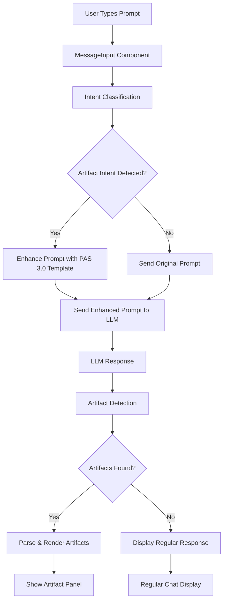

# Artifact System Integration Implementation Plan

## Executive Summary

This document outlines the implementation plan to complete the Open WebUI artifact system integration. The system currently has all components built but lacks the critical connection between intent classification/prompt enhancement and the message sending pipeline.

## Current State Analysis

### ✅ **Completed Components**
- Intent Classification System (`src/lib/utils/artifacts/intent-classifier.ts`)
- Prompt Enhancement Logic (`src/lib/utils/artifacts/intent-classifier.ts:244`)
- PAS 3.0 Artifact Parser (`src/lib/utils/artifacts/artifact-parser.ts`)
- Artifact Rendering System (`src/lib/components/artifacts/`)
- State Management (`src/lib/stores/artifacts/artifact-store.ts`)
- Integration Utilities (`src/lib/utils/artifacts/integration.ts`)

### ❌ **Missing Integration**
- Connection between `useArtifactIntegration().preprocessPrompt()` and message sending
- Intent classification not triggered during chat interactions
- Prompt enhancement not applied before LLM requests

## Implementation Phases

### Phase 1: Core Integration (Priority: Critical)
**Estimated Time:** 2-4 hours

1. **Modify Message Input Component**
   - File: `src/lib/components/chat/MessageInput.svelte`
   - Add artifact integration import
   - Implement prompt preprocessing before API calls
   - Add debug logging for verification

2. **Update Chat Component**
   - File: `src/lib/components/chat/Chat.svelte`
   - Integrate preprocessing in message creation flow
   - Ensure proper error handling

3. **API Integration Points**
   - Identify all LLM API call locations
   - Add preprocessing hooks before `generateOpenAIChatCompletion()`
   - Maintain backward compatibility

### Phase 2: Testing & Validation (Priority: High)
**Estimated Time:** 2-3 hours

1. **Unit Tests**
   - Test intent classification with various prompts
   - Verify prompt enhancement logic
   - Test integration hooks

2. **Integration Tests**
   - End-to-end workflow testing
   - Error handling validation
   - Performance impact assessment

3. **User Acceptance Testing**
   - Test with real artifact creation scenarios
   - Verify UI/UX flow
   - Cross-browser compatibility

### Phase 3: Documentation & Optimization (Priority: Medium)
**Estimated Time:** 1-2 hours

1. **Update Documentation**
   - Integration guide updates
   - API reference updates
   - Troubleshooting guides

2. **Performance Optimization**
   - Lazy loading improvements
   - Bundle size optimization
   - Memory usage optimization

## Technical Implementation Details

### Integration Architecture



### Implementation Strategy

#### 1. **Hook Integration Points**

**Primary Integration Point:**
```typescript
// In MessageInput.svelte or Chat.svelte
import { useArtifactIntegration } from '$lib/utils/artifacts/integration';

const { preprocessPrompt, postprocessResponse } = useArtifactIntegration();

// Before API call
const enhancedPrompt = preprocessPrompt(userPrompt);

// After API response
const artifacts = postprocessResponse(response, messageId);
```

**Alternative Integration Points:**
- API wrapper functions
- Message creation utilities
- Chat completion handlers

#### 2. **Error Handling Strategy**

```typescript
function safePreprocessPrompt(prompt: string): string {
  try {
    return preprocessPrompt(prompt);
  } catch (error) {
    console.warn('Artifact preprocessing failed, using original prompt:', error);
    return prompt;
  }
}
```

#### 3. **Configuration Options**

```typescript
interface ArtifactConfig {
  enabled: boolean;
  confidenceThreshold: number;
  debugMode: boolean;
  maxPromptEnhanceLength: number;
}
```

## Risk Assessment & Mitigation

### High Risk Items
1. **Breaking Existing Chat Flow**
   - Mitigation: Feature flag controlled rollout
   - Fallback to original prompt on errors

2. **Performance Impact**
   - Mitigation: Lightweight intent classification
   - Async processing where possible

3. **User Experience Disruption**
   - Mitigation: Seamless integration
   - Clear feedback for enhanced prompts

### Medium Risk Items
1. **Increased Bundle Size**
   - Mitigation: Lazy loading of classification logic
   - Tree shaking for unused components

2. **API Rate Limiting**
   - Mitigation: Same number of API calls
   - Enhanced prompts may increase token usage

## Success Criteria

### Functional Requirements
- [ ] Intent classification triggers on appropriate prompts
- [ ] Prompt enhancement adds PAS 3.0 instructions
- [ ] Enhanced prompts generate more artifacts
- [ ] Existing chat functionality unchanged
- [ ] Error handling prevents chat breakage

### Performance Requirements
- [ ] <100ms additional latency for prompt processing
- [ ] <5% increase in bundle size
- [ ] Memory usage remains stable

### User Experience Requirements
- [ ] Transparent artifact enhancement
- [ ] Optional debug mode for developers
- [ ] Graceful degradation on failures

## Testing Plan

### Unit Testing
```bash
# Test files to create/update
src/lib/utils/artifacts/integration.test.ts
src/lib/components/chat/MessageInput.test.ts
src/lib/components/chat/Chat.test.ts
```

### Integration Testing Scenarios
1. **Basic Artifact Request**
   - Input: "Create a React counter component"
   - Expected: Enhanced prompt with PAS 3.0 template
   - Verification: Artifact generated and rendered

2. **Non-Artifact Request**
   - Input: "What is the capital of France?"
   - Expected: Original prompt unchanged
   - Verification: Normal response handling

3. **Edge Cases**
   - Empty prompts
   - Very long prompts
   - Special characters
   - Multiple artifact requests

### Performance Testing
- Measure classification time across various prompt lengths
- Memory usage monitoring
- Bundle size impact analysis

## Deployment Strategy

### Phase 1: Development Environment
- Implement with feature flag disabled by default
- Enable for testing and validation
- Comprehensive logging for debugging

### Phase 2: Staging Deployment
- Enable feature flag for staging
- User acceptance testing
- Performance monitoring

### Phase 3: Production Rollout
- Gradual rollout with feature flag
- Monitor error rates and performance
- Full rollout after validation

## Monitoring & Observability

### Metrics to Track
- Intent classification accuracy
- Prompt enhancement success rate
- Artifact generation rate improvement
- Error rates and failure modes
- Performance impact on chat latency

### Logging Strategy
```typescript
// Debug logging structure
console.log('[Artifact Integration]', {
  stage: 'intent_classification',
  prompt: prompt.substring(0, 100),
  intent: classification.intent,
  confidence: classification.confidence,
  enhanced: shouldEnhance
});
```

### Error Tracking
- Classification failures
- Enhancement errors
- Integration hook failures
- API call impacts

## Rollback Plan

### Immediate Rollback Triggers
- Chat functionality broken
- Significant performance degradation
- High error rates (>5%)

### Rollback Procedure
1. Disable feature flag
2. Revert to original chat flow
3. Investigate issues
4. Implement fixes
5. Re-enable gradually

## Future Enhancements

### Short Term (Next Sprint)
- User configurable confidence thresholds
- Artifact type preferences
- Enhanced debug UI

### Medium Term (Next Quarter)
- Machine learning enhancement of intent classification
- Custom artifact templates
- Multi-language support

### Long Term (Next Year)
- Collaborative artifact editing
- Artifact versioning
- Plugin system for custom renderers

## Conclusion

This implementation plan provides a structured approach to completing the artifact system integration. The phased approach minimizes risk while ensuring comprehensive testing and validation. The success of this integration will significantly enhance OpenWebUI's ability to generate and display interactive artifacts, creating a more powerful AI-assisted development experience.