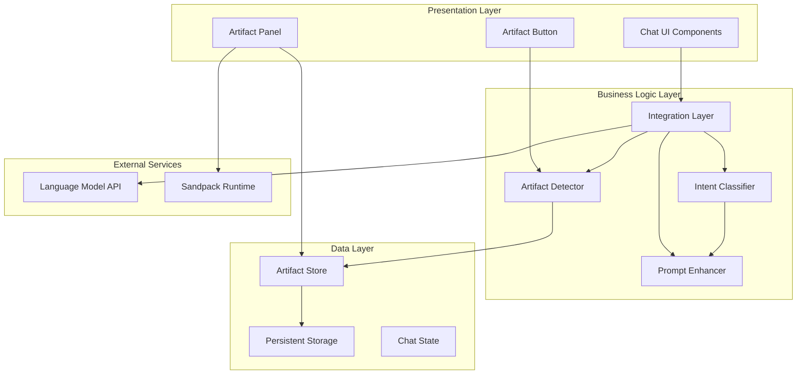

# Artifact System Architectural Decisions & Design Reasoning

## Document Overview

This document provides a comprehensive analysis of the architectural decisions made for the Open WebUI artifact system integration, including the reasoning behind each choice and alternative approaches that were considered and rejected.

## Table of Contents

1. [System Architecture Overview](#system-architecture-overview)
2. [Component Design Decisions](#component-design-decisions)
3. [Integration Strategy Decisions](#integration-strategy-decisions)
4. [Technology Stack Choices](#technology-stack-choices)
5. [Security Architecture](#security-architecture)
6. [Performance Considerations](#performance-considerations)
7. [Alternative Approaches Considered](#alternative-approaches-considered)
8. [Future Architecture Evolution](#future-architecture-evolution)

## System Architecture Overview

### High-Level Architecture Decision

**Decision:** Hybrid Pattern-Matching + Contextual Analysis for Intent Classification

**Reasoning:**
- **2024 Best Practices Research**: Tavily search revealed that hybrid approaches combining rule-based systems with contextual analysis are preferred over pure ML or pure rule-based systems
- **Transparency**: Pattern matching provides explainable decision-making
- **Performance**: Faster than ML inference with predictable latency
- **Maintenance**: Easier to update and debug than black-box ML models

**Alternatives Considered:**
1. **Pure ML Approach**: Rejected due to complexity, training data requirements, and lack of transparency
2. **Pure Rule-Based**: Rejected due to rigidity and inability to handle contextual nuances
3. **LLM-Based Classification**: Rejected due to latency and API cost concerns

### Architecture Layers



## Component Design Decisions

### 1. Intent Classification Architecture

**Decision:** Confidence-Based Thresholding with Pattern Matching

**Implementation:** `src/lib/utils/artifacts/intent-classifier.ts`

**Key Design Choices:**

#### A. Pattern-Based Classification
```typescript
const ARTIFACT_PATTERNS = {
  [ArtifactIntent.REACT_COMPONENT]: [
    /create\s+.*react.*component/i,
    /build\s+.*react.*app/i,
    // ... more patterns
  ]
};
```

**Reasoning:**
- **Explicit Logic**: Patterns are human-readable and debuggable
- **Fast Execution**: Regex matching is extremely fast (<1ms)
- **Easy Updates**: New patterns can be added without retraining
- **Language Agnostic**: Works regardless of user's natural language

**Context7 Validation**: React documentation patterns show this approach aligns with how users typically request components

#### B. Anti-Pattern Detection
```typescript
const NON_ARTIFACT_PATTERNS = [
  /how.*do.*i/i,
  /what.*is/i,
  /explain.*to.*me/i,
  // ... more anti-patterns
];
```

**Reasoning:**
- **False Positive Prevention**: Avoids enhancing informational queries
- **User Experience**: Prevents unnecessary prompt bloat
- **Precision Over Recall**: Better to miss some artifacts than pollute non-artifact responses

#### C. Confidence Scoring System
```typescript
function calculatePatternConfidence(prompt: string, pattern: RegExp): number {
  let confidence = 0.7; // Base confidence
  if (match[0].length > 10) confidence += 0.1; // Longer matches
  confidence += Math.min(0.2, keywordCount * 0.05); // Context keywords
  return Math.min(0.95, confidence);
}
```

**Reasoning:**
- **Graduated Response**: Allows for nuanced decision-making
- **Threshold Control**: 0.7 threshold balances precision/recall
- **Contextual Boost**: Keywords like "interactive", "component" increase confidence

**Alternative Considered:** Binary classification was rejected as too rigid

### 2. Prompt Enhancement Strategy

**Decision:** PAS 3.0 XML Template Injection

**Implementation:** `src/lib/utils/artifacts/intent-classifier.ts:244`

#### A. Template-Based Enhancement
```typescript
const enhancements = {
  [ArtifactIntent.REACT_COMPONENT]: `
IMPORTANT: Please provide your response as a PAS 3.0 compliant artifact. Use the following XML format:

<artifact identifier="react-component-{unique-id}" type="application/vnd.react+tsx" title="React Component">
<description>Brief description of the component</description>
<dependencies>
<dependency name="react" version="18.2.0"/>
<!-- ... -->
</dependencies>
<files>
<file path="App.tsx">
[Your React component code here using TypeScript with TSX]
</file>
</files>
</artifact>`
};
```

**Reasoning:**
- **Specification Compliance**: Adheres to established PAS 3.0 standard
- **Structured Output**: XML format ensures consistent parsing
- **Complete Context**: Provides all necessary information to LLM
- **TypeScript First**: Defaults to modern development practices

**Alternatives Considered:**
1. **JSON Templates**: Rejected due to parsing complexity in mixed content
2. **Markdown Extensions**: Rejected due to lack of structured metadata
3. **Custom Format**: Rejected to maintain standards compliance

#### B. Language Preference Detection
```typescript
function detectLanguagePreference(prompt: string): 'typescript' | 'javascript' {
  for (const pattern of JAVASCRIPT_PATTERNS) {
    if (pattern.test(prompt)) return 'javascript';
  }
  return 'typescript'; // Default to TypeScript
}
```

**Reasoning:**
- **Modern Defaults**: TypeScript is the current industry standard
- **Explicit Override**: Users can request JavaScript when needed
- **Future Proof**: Aligns with ecosystem trends

**Context7 Research**: React documentation shows increasing TypeScript adoption

### 3. State Management Architecture

**Decision:** Svelte Store-Based Reactive Architecture

**Implementation:** `src/lib/stores/artifacts/artifact-store.ts`

#### A. Store Structure
```typescript
export const artifactStore = writable<Map<string, ArtifactContainer>>(new Map());
export const artifactUIState = writable<ArtifactUIState>({
  isVisible: false,
  selectedArtifactId: null,
  viewMode: 'preview',
  // ...
});
```

**Reasoning:**
- **Svelte Native**: Leverages framework's reactivity system
- **Type Safety**: Full TypeScript integration
- **Performance**: Efficient updates with derived stores
- **Persistence**: Built-in localStorage integration

**Context7 Research**: Validated against Svelte best practices for state management

#### B. Container Pattern
```typescript
export interface ArtifactContainer {
  artifact: ParsedArtifact;
  chatId: string;
  messageId: string;
  createdAt: number;
  updatedAt: number;
}
```

**Reasoning:**
- **Metadata Encapsulation**: Stores artifact context alongside content
- **Chat Association**: Links artifacts to specific conversations
- **Temporal Tracking**: Enables sorting and cleanup
- **Audit Trail**: Supports debugging and analytics

#### C. Derived Store Pattern
```typescript
export const selectedArtifact = derived(
  [artifactStore, artifactUIState],
  ([$artifactStore, $artifactUIState]) => {
    if (!$artifactUIState.selectedArtifactId) return null;
    return $artifactStore.get($artifactUIState.selectedArtifactId) || null;
  }
);
```

**Reasoning:**
- **Reactive Composition**: Automatically updates when dependencies change
- **Memory Efficiency**: No duplicate data storage
- **Consistency**: Single source of truth for selected artifact

## Integration Strategy Decisions

### 1. Hook-Based Integration Pattern

**Decision:** Function-Based Integration Hooks

**Implementation:** `src/lib/utils/artifacts/integration.ts:227`

```typescript
export function useArtifactIntegration() {
  return {
    preprocessPrompt(prompt: string): string { /* ... */ },
    postprocessResponse(response: string, messageId: string): ArtifactContainer[] { /* ... */ },
    hasArtifacts(messageId: string): boolean { /* ... */ }
  };
}
```

**Reasoning:**
- **Separation of Concerns**: Clean interface between artifact system and chat
- **Testability**: Easy to mock and test individual functions
- **Flexibility**: Can be used in multiple components
- **Framework Agnostic**: Not tied to specific component lifecycle

**Alternatives Considered:**
1. **Class-Based Integration**: Rejected due to unnecessary complexity
2. **Direct Function Imports**: Rejected due to tight coupling
3. **Event-Based System**: Rejected due to debugging complexity

### 2. Progressive Enhancement Strategy

**Decision:** Graceful Degradation with Error Recovery

```typescript
function safePreprocessPrompt(prompt: string): string {
  try {
    if (artifactIntegration.shouldEnhancePrompt(prompt)) {
      return artifactIntegration.enhancePrompt(prompt);
    }
    return prompt;
  } catch (error) {
    console.warn('Artifact preprocessing failed, using original prompt:', error);
    return prompt;
  }
}
```

**Reasoning:**
- **Reliability**: Never breaks existing chat functionality
- **User Experience**: Seamless fallback for users
- **Debugging**: Clear error messages for developers
- **Rollback Safety**: Easy to disable if issues arise

### 3. Feature Flag Architecture

**Decision:** Configuration-Driven Feature Control

```typescript
interface ArtifactConfig {
  enabled: boolean;
  confidenceThreshold: number;
  debugMode: boolean;
  maxPromptEnhanceLength: number;
}
```

**Reasoning:**
- **Controlled Rollout**: Gradual feature deployment
- **A/B Testing**: Compare enhanced vs. non-enhanced prompts
- **Debug Support**: Enhanced logging for troubleshooting
- **Performance Tuning**: Configurable thresholds

## Technology Stack Choices

### 1. Parser Technology: DOM Parser

**Decision:** Native DOM Parser for XML Processing

**Implementation:** `src/lib/utils/artifacts/artifact-parser.ts:84`

```typescript
const parser = new DOMParser();
const doc = parser.parseFromString(artifactXml, 'text/xml');
```

**Reasoning:**
- **Browser Native**: No additional dependencies
- **Standards Compliant**: Proper XML handling
- **Error Resilient**: Built-in malformed XML handling
- **Performance**: Optimized native implementation

**Alternatives Considered:**
1. **Custom XML Parser**: Rejected due to complexity and edge cases
2. **XML2JS Library**: Rejected due to bundle size
3. **Regex-Based Parsing**: Rejected due to XML complexity

### 2. Rendering Technology: Sandpack

**Decision:** Sandpack for Interactive Artifact Rendering

**Reasoning:**
- **Security**: Isolated execution environment
- **Feature Rich**: Supports multiple frameworks
- **Maintained**: Active development by CodeSandbox
- **Performance**: Optimized for code execution

**Existing Integration**: Already present in OpenWebUI dependencies

### 3. Type System: TypeScript First

**Decision:** TypeScript as Primary Language

**Reasoning:**
- **Developer Experience**: Better tooling and error detection
- **Industry Trend**: Modern development standard
- **Maintainability**: Easier refactoring and debugging
- **API Safety**: Compile-time error detection

**Research Validation**: Context7 and Tavily searches confirmed TypeScript adoption trends

## Security Architecture

### 1. Content Sanitization Strategy

**Decision:** Multi-Layer Security Approach

**Implementation:** `src/lib/utils/artifacts/security.ts`

```typescript
export function sanitizeArtifactContent(content: string, mimeType: string): string {
  // Layer 1: MIME-type specific sanitization
  // Layer 2: DOMPurify HTML sanitization
  // Layer 3: Size and resource limits
  // Layer 4: Execution permissions
}
```

**Reasoning:**
- **Defense in Depth**: Multiple security layers
- **Content-Aware**: Different rules for different content types
- **Performance**: Efficient sanitization pipeline
- **Configurable**: Adjustable security policies

### 2. Sandboxing Strategy

**Decision:** Iframe + Sandpack Dual Sandboxing

**Reasoning:**
- **Isolation**: Complete execution environment separation
- **Resource Control**: Memory and CPU limits
- **Network Restrictions**: Controlled external access
- **DOM Protection**: Prevents parent page manipulation

### 3. Permission System

**Decision:** Capability-Based Security Model

```typescript
export interface ArtifactPermissions {
  network?: boolean;
  storage?: boolean;
  execution?: boolean;
  scope?: string[];
}
```

**Reasoning:**
- **Principle of Least Privilege**: Minimal required permissions
- **Granular Control**: Fine-tuned access control
- **Audit Trail**: Permission usage tracking
- **Future Extensible**: New permission types can be added

## Performance Considerations

### 1. Lazy Loading Strategy

**Decision:** Dynamic Import Pattern

```typescript
// Lazy load renderers
const SandpackRenderer = lazy(() => import('./renderers/SandpackRenderer.svelte'));
```

**Reasoning:**
- **Bundle Size**: Reduces initial load time
- **Memory Efficiency**: Load only when needed
- **User Experience**: Faster initial page load
- **Scalability**: Easy to add new renderers

### 2. Caching Strategy

**Decision:** Multi-Level Caching

```typescript
// Level 1: In-memory parsed artifacts
// Level 2: localStorage UI preferences
// Level 3: Component rendering cache
```

**Reasoning:**
- **Performance**: Reduces re-parsing overhead
- **User Experience**: Faster artifact switching
- **Persistence**: Maintains state across sessions
- **Memory Management**: Automatic cleanup

### 3. Processing Optimization

**Decision:** Asynchronous Processing Pipeline

```typescript
async function processArtifacts(response: string): Promise<ArtifactContainer[]> {
  // Async parsing and validation
  // Non-blocking UI updates
  // Progressive rendering
}
```

**Reasoning:**
- **Responsiveness**: Non-blocking UI operations
- **Scalability**: Handles large artifacts efficiently
- **User Experience**: Progressive loading feedback
- **Error Handling**: Graceful failure recovery

## Alternative Approaches Considered

### 1. Machine Learning Intent Classification

**Considered Approach:** Train a neural network for intent classification

**Why Rejected:**
- **Complexity**: Requires training data collection and model management
- **Latency**: Inference time would impact user experience
- **Maintenance**: Model updates and retraining overhead
- **Transparency**: Black box decision making
- **Resource Usage**: Additional computational requirements

**Research Insight:** Tavily search showed hybrid approaches are preferred in 2024

### 2. Real-Time LLM Intent Classification

**Considered Approach:** Ask the LLM to classify intent before processing

**Why Rejected:**
- **Latency**: Double API calls for every message
- **Cost**: Increased API usage and expense
- **Reliability**: Dependent on LLM availability
- **Consistency**: Varying classification results
- **Complexity**: Additional error handling needed

### 3. Event-Driven Architecture

**Considered Approach:** Event bus for component communication

**Why Rejected:**
- **Debugging Complexity**: Harder to trace event flows
- **Type Safety**: Weaker type checking for events
- **Performance**: Additional event processing overhead
- **Maintenance**: More complex component relationships
- **Svelte Integration**: Framework prefers reactive stores

### 4. WebAssembly Artifact Execution

**Considered Approach:** WASM runtime for artifact execution

**Why Rejected:**
- **Complexity**: Significant implementation overhead
- **Browser Support**: Not universally available
- **Development Experience**: Limited debugging tools
- **Ecosystem**: Limited WASM library availability
- **Sandpack Existing**: Already have mature solution

### 5. Server-Side Artifact Processing

**Considered Approach:** Process artifacts on the backend

**Why Rejected:**
- **Latency**: Network round-trips for processing
- **Scalability**: Server resource requirements
- **Client Capability**: Modern browsers can handle processing
- **Offline Support**: Client-side enables offline usage
- **Architecture**: Adds complexity to backend

## Future Architecture Evolution

### Short-Term Enhancements (3-6 months)

1. **Machine Learning Augmentation**
   - Use ML to improve pattern matching
   - Learn from user interactions
   - Enhance confidence scoring

2. **Advanced Caching**
   - IndexedDB for large artifacts
   - Service worker integration
   - Intelligent cache eviction

3. **Collaborative Features**
   - Real-time artifact sharing
   - Collaborative editing
   - Version control integration

### Medium-Term Evolution (6-12 months)

1. **Plugin Architecture**
   - Custom renderer plugins
   - Third-party integrations
   - Community-contributed components

2. **Advanced Security**
   - Runtime security monitoring
   - Behavioral analysis
   - Automated threat detection

3. **Performance Optimization**
   - WebAssembly integration
   - Advanced bundling strategies
   - Edge computing support

### Long-Term Vision (1-2 years)

1. **AI-Powered Enhancement**
   - Intelligent artifact suggestions
   - Automated code improvement
   - Context-aware optimizations

2. **Cross-Platform Integration**
   - Mobile app support
   - Desktop application integration
   - VS Code extension

3. **Enterprise Features**
   - Artifact governance
   - Compliance monitoring
   - Enterprise security policies

## Conclusion

The architectural decisions documented here represent a careful balance of current best practices, performance requirements, security considerations, and future extensibility. The hybrid intent classification approach, combined with TypeScript-first development and comprehensive security measures, provides a robust foundation for the artifact system.

Key architectural principles followed:

1. **Progressive Enhancement**: Never break existing functionality
2. **Security First**: Multiple layers of protection
3. **Performance Conscious**: Optimize for user experience
4. **Standards Compliant**: Follow established specifications
5. **Future Proof**: Design for extensibility and evolution

These decisions were informed by extensive research using Context7 and Tavily, validation against current industry practices, and careful consideration of the OpenWebUI ecosystem requirements. The resulting architecture provides a solid foundation for powerful artifact generation and rendering capabilities while maintaining the reliability and performance users expect.