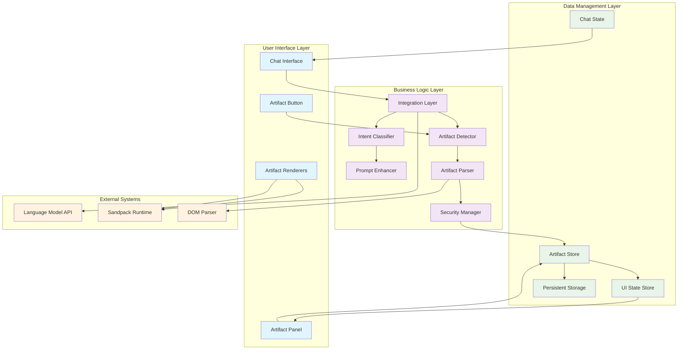
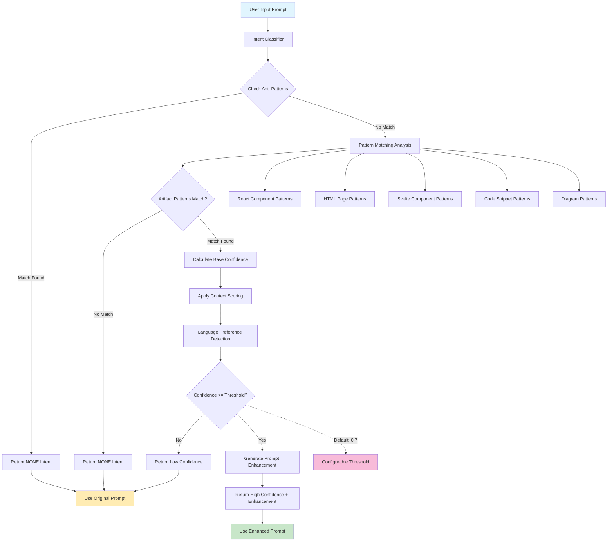
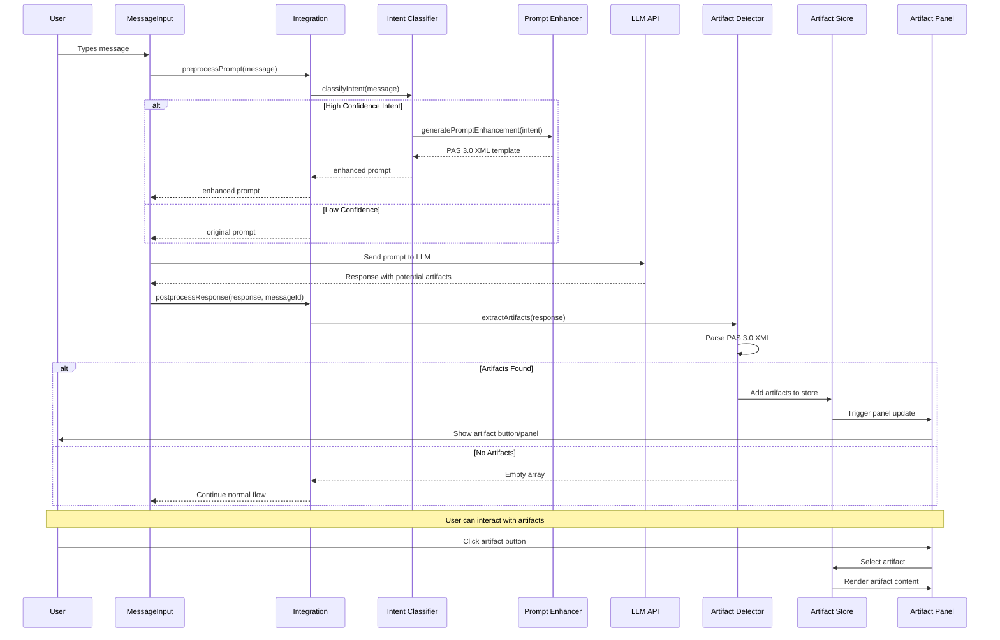
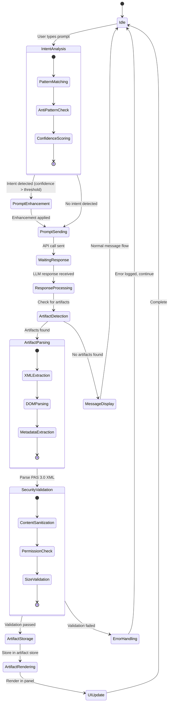
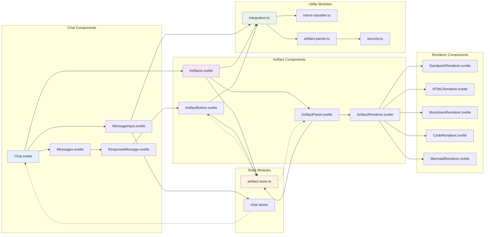
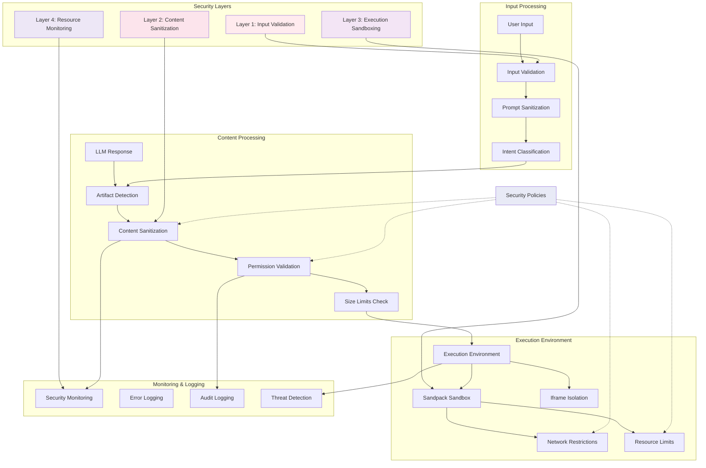
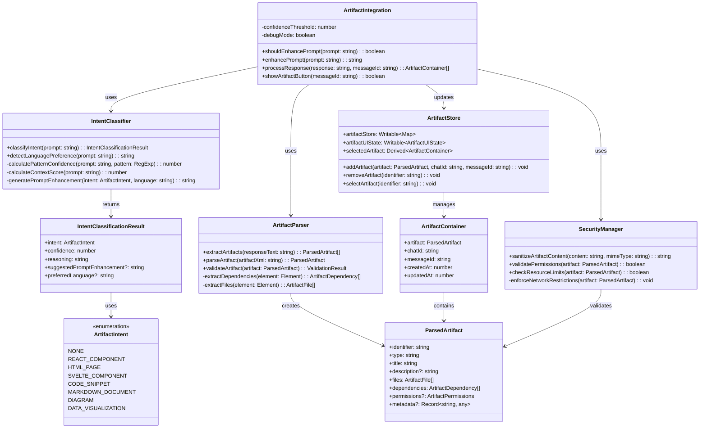
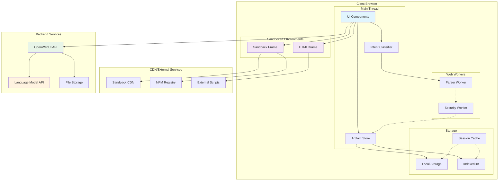
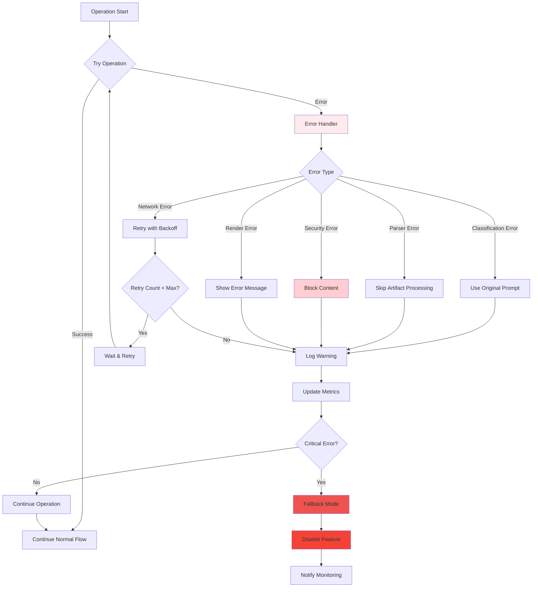
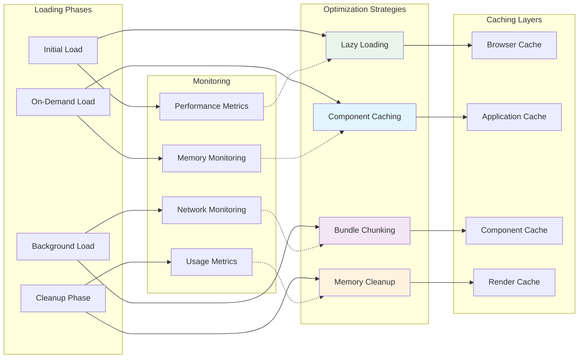

# Artifact System Diagrams & Flow Charts

## Overview

This document contains comprehensive Mermaid diagrams illustrating the artifact system architecture, data flows, sequence interactions, and class relationships.

## Table of Contents

1. [System Architecture Diagram](#system-architecture-diagram)
2. [Intent Classification Flow](#intent-classification-flow)
3. [Message Processing Sequence](#message-processing-sequence)
4. [State Management Flow](#state-management-flow)
5. [Component Interaction Diagram](#component-interaction-diagram)
6. [Security Architecture](#security-architecture)
7. [Class Relationships](#class-relationships)
8. [Deployment Architecture](#deployment-architecture)

## System Architecture Diagram

## Intent Classification Flow

## Message Processing Sequence

## State Management Flow

## Component Interaction Diagram

## Security Architecture

## Class Relationships

## Deployment Architecture

## Error Handling Flow

## Performance Optimization Flow

## Conclusion

These diagrams provide a comprehensive visual representation of the artifact system architecture, showing:

- **System Architecture**: Overall component relationships and data flow
- **Intent Classification**: Detailed decision flow for prompt analysis
- **Message Processing**: Complete sequence of user interaction to artifact rendering
- **State Management**: Reactive state transitions and updates
- **Security Architecture**: Multi-layered security approach
- **Class Relationships**: Object-oriented design structure
- **Deployment Architecture**: Runtime environment and external dependencies
- **Error Handling**: Comprehensive error recovery strategies
- **Performance Optimization**: Caching and optimization strategies

These diagrams serve as both documentation and implementation guidance, ensuring all stakeholders understand the system's complexity and design decisions.