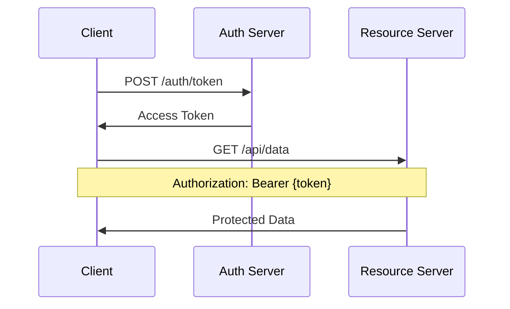

# Prometheus Artifact Specification 3.0 (PAS 3.0)

## Universal Portable Artifacts for AI-Powered Applications

> **Version**: 3.0.0  
> **Status**: Release Candidate  
> **Date**: January 2025  
> **Namespace**: `https://prometheusags.ai/schema/v3.0`

---

## Executive Summary

The Prometheus Artifact Specification 3.0 (PAS 3.0) establishes a universal standard for **portable, executable artifacts** that seamlessly operate across diverse AI platforms and development environments. Building upon the Enhanced XML Artifact Specification v2.0, PAS 3.0 introduces groundbreaking capabilities for agent integration, enhanced rendering modes, and enterprise-grade security while maintaining full backward compatibility.

### Key Innovations

- **Multi-Kind Artifacts**: Support for UI components, Markdown documentation, and Agent definitions
- **Agent-Aware Architecture**: Native integration with MCP, OpenAI, REST, and Agent Protocol
- **Universal Rendering**: Markdown with Mermaid diagrams, React/Vue/Svelte components, and custom frameworks
- **Enterprise Security**: Comprehensive permission model, CSP enforcement, and sandboxing policies
- **Cross-Platform Portability**: Verified compatibility across 6+ major platforms

### Supported Platforms

- **Claude Desktop** (MCP native)
- **LobeChat** (Web & Desktop)
- **LibreChat** (Open source)
- **OpenWebUI** (Self-hosted)
- **ChatGPT** (GPT Actions/Canvas)
- **Cherry Studio** (Electron-based)
- **Tauri Applications** (Native desktop)
- **Web Hosts** (Standard deployment)

---

## Table of Contents

1. [Introduction & Scope](#1-introduction--scope)
2. [Backward Compatibility](#2-backward-compatibility)
3. [Core Schema](#3-core-schema)
4. [Artifact Kinds](#4-artifact-kinds)
5. [Actions System](#5-actions-system)
6. [Data Bindings](#6-data-bindings)
7. [Container Bridge Protocol](#7-container-bridge-protocol)
8. [Rendering Containers](#8-rendering-containers)
9. [Security & Permissions](#9-security--permissions)
10. [Platform Adapters](#10-platform-adapters)
11. [Registry & Distribution](#11-registry--distribution)
12. [Implementation Examples](#12-implementation-examples)
13. [Migration Guide](#13-migration-guide)
14. [Validation & Compliance](#14-validation--compliance)
15. [Best Practices](#15-best-practices)
16. [Appendices](#16-appendices)

---

## 1. Introduction & Scope

### 1.1 Purpose

PAS 3.0 standardizes the creation, distribution, and execution of portable artifacts across AI-powered platforms. It enables developers to write once and deploy everywhere, ensuring consistent behavior and security across diverse environments.

### 1.2 Design Principles

1. **Portability First**: Artifacts must run identically across all supported platforms
2. **Security by Default**: Comprehensive permission model with deny-by-default networking
3. **Progressive Enhancement**: Basic functionality works everywhere; advanced features activate when available
4. **Developer Experience**: Clear, intuitive syntax with excellent tooling support
5. **Performance**: Optimized for fast loading and efficient execution
6. **Accessibility**: WCAG 2.1 AA compliance for all UI artifacts

### 1.3 What's New in 3.0

- **Artifact Kinds**: Explicit declaration of rendering requirements (`ui`, `markdown`, `agent`)
- **Agent Integration**: First-class support for AI agent definitions and invocations
- **Enhanced Markdown**: Native Mermaid diagrams, code highlighting, and interactive elements
- **Framework Expansion**: Support for Svelte, Vue, Angular, and custom micro-frameworks
- **Improved Security**: Stricter CSP, rate limiting, and domain allowlisting
- **Better Tooling**: XSD validation, migration utilities, and debugging support

---

## 2. Backward Compatibility

### 2.1 Compatibility Promise

**All v2.0 artifacts continue to work without modification.** PAS 3.0 is strictly additive:

- v2.0 namespace (`https://artifacts.ai/schema/v2.0`) remains valid
- All v2.0 elements and attributes are preserved
- New features are optional unless explicitly marked as required
- Automatic migration tools available for v2.0 → v3.0

### 2.2 Namespace Migration

```xml
<!-- v2.0 (still works) -->
<artifact xmlns="https://artifacts.ai/schema/v2.0">

<!-- v3.0 (new features available) -->
<artifact xmlns="https://prometheusags.ai/schema/v3.0">
```

### 2.3 Default Behaviors

When `kind` is not specified:

- `type="react|html|vue|svelte|angular"` → defaults to `kind="ui"`
- `type="markdown"` → defaults to `kind="markdown"`
- `type="agent"` → defaults to `kind="agent"`

---

## 3. Core Schema

### 3.1 Root Element

```xml
<?xml version="1.0" encoding="UTF-8"?>
<artifact
  xmlns="https://prometheusags.ai/schema/v3.0"
  xmlns:xsi="http://www.w3.org/2001/XMLSchema-instance"
  xsi:schemaLocation="https://prometheusags.ai/schema/v3.0 artifact-v3.xsd"
  type="react|html|vue|svelte|angular|markdown|agent"
  kind="ui|markdown|agent"
  id="unique-artifact-id"
  version="3.0.0">
```

### 3.2 Required Attributes

| Attribute | Type   | Description                                        |
|-----------|--------|----------------------------------------------------|
| `xmlns`   | URI    | Namespace declaration (v3.0)                      |
| `type`    | Enum   | Framework/language type                           |
| `id`      | String | Unique identifier (alphanumeric + dash/underscore)|

### 3.3 Optional Attributes

| Attribute | Type   | Default              | Description                    |
|-----------|--------|----------------------|--------------------------------|
| `kind`    | Enum   | Inferred from `type` | Rendering requirement category |
| `version` | String | "1.0.0"              | Semantic version of artifact   |

### 3.4 Child Elements

```xml
<artifact>
  <!-- Required -->
  <code language="typescript|javascript|markdown|python|rust">...</code>
  
  <!-- Optional -->
  <metadata>...</metadata>
  <dependencies>...</dependencies>
  <environment>...</environment>
  <actions>...</actions>
  <data-bindings>...</data-bindings>
  <agent-definition>...</agent-definition>
  <markdown-renderer>...</markdown-renderer>
  <sandpack>...</sandpack>
  <container-bridge>...</container-bridge>
  <permissions>...</permissions>
  <preview>...</preview>
</artifact>
```

---

## 4. Artifact Kinds

### 4.1 UI Artifacts (`kind="ui"`)

Interactive components using modern web frameworks.

#### Supported Types

- `react` - React 19+ components
- `vue` - Vue 3+ components
- `svelte` - Svelte 4+ components
- `angular` - Angular 15+ components
- `html` - Vanilla HTML/JS (including micro-frameworks)

#### Features

- Full Sandpack integration
- Hot module replacement in development
- Component prop validation
- State management support
- Event handling via bridge

#### Example Structure

```xml
<artifact type="react" kind="ui" id="login-component">
  <metadata>
    <title>Login Component</title>
    <description>Secure authentication form with 2FA support</description>
  </metadata>
  
  <dependencies>
    <dependency name="react" version="^19.0.0"/>
    <dependency name="@shadcn/ui" version="latest"/>
    <dependency name="zod" version="^3.22.0"/>
  </dependencies>
  
  <code language="typescript">
    <![CDATA[
    import React, { useState } from 'react';
    import { Button } from '@/components/ui/button';
    import { Input } from '@/components/ui/input';
    
    export const LoginComponent: React.FC = () => {
      const [email, setEmail] = useState('');
      const [password, setPassword] = useState('');
      
      return (
        <div className="w-full max-w-md mx-auto p-6">
          <h2 className="text-2xl font-bold mb-4">Sign In</h2>
          <form className="space-y-4">
            <Input
              type="email"
              placeholder="Email"
              value={email}
              onChange={(e) => setEmail(e.target.value)}
            />
            <Input
              type="password"
              placeholder="Password"
              value={password}
              onChange={(e) => setPassword(e.target.value)}
            />
            <Button type="submit" className="w-full">
              Sign In
            </Button>
          </form>
        </div>
      );
    };
    
    export default LoginComponent;
    ]]>
  </code>
</artifact>
```

### 4.2 Markdown Artifacts (`kind="markdown"`)

Rich documentation with embedded diagrams and interactive elements.

#### Features

- GitHub Flavored Markdown (GFM)
- Mermaid diagram support
- Syntax highlighting for 100+ languages
- Table of contents generation
- Footnotes and references
- Math rendering (KaTeX/MathJax)

#### Security

- No inline `<script>` tags
- HTML sanitization
- CSP enforcement
- Safe iframe embedding

#### Example

```xml
<artifact type="markdown" kind="markdown" id="api-documentation">
  <metadata>
    <title>API Documentation</title>
    <description>Comprehensive API guide with examples</description>
  </metadata>
  
  <markdown-renderer>
    <feature name="mermaid" enabled="true"/>
    <feature name="codeCopy" enabled="true"/>
    <feature name="toc" enabled="true"/>
    <feature name="math" enabled="true" engine="katex"/>
  </markdown-renderer>
  
  <code language="markdown">
    <![CDATA[
# REST API Documentation

## Overview

Our REST API provides programmatic access to all platform features.

## Authentication Flow



## Endpoints

### Authentication

#### POST /auth/token

Obtain an access token for API access.

**Request:**
```json
{
  "email": "user@example.com",
  "password": "secure_password"
}
```

**Response:**
```json
{
  "access_token": "eyJhbGciOiJIUzI1NiIsInR5cCI6IkpXVCJ9...",
  "token_type": "Bearer",
  "expires_in": 3600
}
```

### Data Operations

#### GET /api/users

Retrieve user list with pagination.

**Parameters:**
- `page` (integer): Page number (default: 1)
- `limit` (integer): Items per page (default: 20)

**Example:**
```bash
curl -H "Authorization: Bearer $TOKEN" \
  "https://api.example.com/api/users?page=1&limit=10"
```

## Rate Limits

| Endpoint | Rate Limit |
|----------|------------|
| Authentication | 5/min |
| Data Read | 100/min |
| Data Write | 20/min |

## Error Handling

All errors follow RFC 7807 Problem Details format:

```json
{
  "type": "https://api.example.com/errors/validation",
  "title": "Validation Error", 
  "status": 400,
  "detail": "The email field is required"
}
```
    ]]>
  </code>
</artifact>
```

### 4.3 Agent Artifacts (`kind="agent"`)

Declarative AI agent definitions for code generation and deployment.

#### Supported Frameworks

- **Mastra** - TypeScript agent framework
- **LangGraph.js** - JavaScript graph-based agents
- **Python** - LangChain, AutoGen, custom
- **Rust/Rig** - High-performance agent runtime
- **Custom** - Any framework via templates

#### Structure

```xml
<artifact type="agent" kind="agent" id="code-review-agent">
  <metadata>
    <title>Code Review Agent</title>
    <description>AI agent that performs automated code reviews</description>
  </metadata>
  
  <agent-definition framework="mastra">
    <capabilities>
      <capability>code-analysis</capability>
      <capability>security-scan</capability>
      <capability>performance-check</capability>
      <capability>best-practices</capability>
    </capabilities>
    
    <protocols>
      <protocol>openai</protocol>
      <protocol>mcp</protocol>
    </protocols>
    
    <io>
      <input schema="json-schema">
        <![CDATA[{
          "type": "object",
          "properties": {
            "repository": {"type": "string", "format": "uri"},
            "pull_request": {"type": "integer"},
            "files": {
              "type": "array",
              "items": {"type": "string"}
            }
          },
          "required": ["repository", "pull_request"]
        }]]>
      </input>
      <output schema="json-schema">
        <![CDATA[{
          "type": "object",
          "properties": {
            "overall_score": {"type": "number", "min": 0, "max": 10},
            "issues": {
              "type": "array",
              "items": {
                "type": "object",
                "properties": {
                  "type": {"enum": ["bug", "security", "performance", "style"]},
                  "severity": {"enum": ["low", "medium", "high", "critical"]},
                  "message": {"type": "string"},
                  "file": {"type": "string"},
                  "line": {"type": "integer"}
                }
              }
            },
            "suggestions": {
              "type": "array",
              "items": {"type": "string"}
            }
          }
        }]]>
      </output>
    </io>
    
    <codegen targets="ts">
      <![CDATA[
      import { Agent } from '@mastra/core';
      import { OpenAIProvider } from '@mastra/openai';
      
      export class CodeReviewAgent extends Agent {
        private llm: OpenAIProvider;
        
        constructor() {
          super({
            name: 'code-review-agent',
            description: 'Automated code review assistant'
          });
          
          this.llm = new OpenAIProvider({
            model: 'gpt-4-turbo',
            temperature: 0.1
          });
        }
        
        async process(input: any) {
          const { repository, pull_request, files } = input;
          
          // Fetch PR diff
          const diff = await this.fetchPRDiff(repository, pull_request);
          
          // Analyze code changes
          const analysis = await this.analyzeCode(diff, files);
          
          // Generate review
          const review = await this.generateReview(analysis);
          
          return {
            overall_score: review.score,
            issues: review.issues,
            suggestions: review.suggestions
          };
        }
        
        private async analyzeCode(diff: string, files: string[]) {
          const prompt = `
            Analyze this code diff for:
            1. Security vulnerabilities
            2. Performance issues  
            3. Code quality problems
            4. Best practice violations
            
            Diff:
            ${diff}
          `;
          
          const response = await this.llm.complete({
            messages: [{ role: 'user', content: prompt }]
          });
          
          return JSON.parse(response.content);
        }
        
        private async generateReview(analysis: any) {
          // Process analysis results and generate structured review
          return {
            score: this.calculateScore(analysis),
            issues: this.extractIssues(analysis),
            suggestions: this.generateSuggestions(analysis)
          };
        }
      }
      ]]>
    </codegen>
  </agent-definition>
</artifact>
```

---

## 5. Actions System

### 5.1 Action Types

| Type           | Description           | Use Case                        |
|----------------|----------------------|--------------------------------|
| `api-call`     | REST API invocation  | Data fetching, CRUD operations |
| `form-submit`  | Form data submission | User authentication, data entry|
| `websocket`    | WebSocket connection | Real-time updates, chat        |
| `agent-call`   | AI agent invocation  | LLM queries, tool execution    |
| `state-change` | Internal state update| UI synchronization             |
| `navigation`   | Route/page change    | SPA navigation                 |

### 5.2 Action Structure

```xml
<actions>
  <action id="submit-form" type="form-submit">
    <!-- Trigger Configuration -->
    <trigger event="submit" target="#user-form"/>
    
    <!-- Endpoint Configuration -->
    <endpoint>${API_BASE_URL}/users</endpoint>
    <method>POST</method>
    
    <!-- Headers -->
    <headers>
      <header name="Authorization">Bearer ${AUTH_TOKEN}</header>
      <header name="Content-Type">application/json</header>
    </headers>
    
    <!-- Request Body -->
    <body type="json">
      <![CDATA[{
        "name": "${FORM.name}",
        "email": "${FORM.email}",
        "role": "${FORM.role}"
      }]]>
    </body>
    
    <!-- Response Handling -->
    <response>
      <handler>updateUserList</handler>
    </response>
    
    <!-- Event Handlers -->
    <onSuccess>showSuccessMessage</onSuccess>
    <onError>showErrorMessage</onError>
  </action>
</actions>
```

### 5.3 Agent Call Actions (New in 3.0)

Special action type for AI agent invocations:

```xml
<action id="analyze-code" type="agent-call">
  <trigger event="click" target="#analyze-button"/>
  <endpoint>agent://code-review/analyze</endpoint>
  <protocol>openai</protocol>
  
  <body type="json">
    <![CDATA[{
      "code": "${EDITOR.content}",
      "language": "${EDITOR.language}",
      "context": {
        "project_type": "web-app",
        "framework": "react"
      }
    }]]>
  </body>
  
  <tooling>
    <tool name="static-analysis" schemaRef="#/tools/static-analysis"/>
    <tool name="security-scan" schemaRef="#/tools/security-scan"/>
  </tooling>
  
  <response>
    <handler>displayAnalysisResults</handler>
  </response>
  
  <onSuccess>highlightIssues</onSuccess>
  <onError>showAnalysisError</onError>
</action>
```

---

## 6. Data Bindings

### 6.1 Binding Types

| Type       | Description          | Update Strategy     |
|------------|---------------------|-------------------|
| `static`   | One-time load       | Initial render only|
| `cached`   | Periodic refresh    | TTL-based         |
| `realtime` | Live updates        | WebSocket/SSE     |
| `agent`    | AI-powered retrieval| On-demand         |

### 6.2 Binding Structure

```xml
<data-bindings>
  <binding id="user-profile" type="cached">
    <!-- Data Source -->
    <source type="api">
      <endpoint>${API_BASE_URL}/users/profile</endpoint>
      <headers>
        <header name="Authorization">Bearer ${AUTH_TOKEN}</header>
      </headers>
    </source>
    
    <!-- JSON Schema -->
    <schema>
      <![CDATA[{
        "$schema": "http://json-schema.org/draft-07/schema#",
        "type": "object",
        "properties": {
          "id": {"type": "string"},
          "name": {"type": "string"},
          "email": {"type": "string", "format": "email"},
          "avatar": {"type": "string", "format": "uri"},
          "role": {"enum": ["admin", "user", "guest"]}
        },
        "required": ["id", "name", "email"]
      }]]>
    </schema>
    
    <!-- Data Transformation -->
    <transform>
      <![CDATA[
      (data) => ({
        ...data,
        displayName: `${data.name} (${data.role})`,
        initials: data.name.split(' ').map(n => n[0]).join('').toUpperCase()
      })
      ]]>
    </transform>
    
    <!-- Refresh Strategy -->
    <refresh-strategy>
      <type>interval</type>
      <interval>300000</interval> <!-- 5 minutes -->
    </refresh-strategy>
    
    <!-- Fallback Data -->
    <fallback>
      <![CDATA[{
        "id": "guest",
        "name": "Guest User",
        "email": "",
        "role": "guest"
      }]]>
    </fallback>
  </binding>
</data-bindings>
```

---

## 7. Container Bridge Protocol

### 7.1 Communication Protocols

| Protocol      | Use Case    | Platforms             |
|---------------|-------------|-----------------------|
| `postMessage` | Web/iframe  | All web platforms     |
| `websocket`   | Real-time   | Server-connected apps |
| `ipc`         | Native apps | Electron, Tauri       |

### 7.2 Message Types

```typescript
interface ContainerMessage {
  type: 'ACTION' | 'DATA_UPDATE' | 'STATE_SYNC' | 'ERROR' | 'READY';
  artifactId: string;
  timestamp: number;
  payload: any;
}
```

### 7.3 Bridge Configuration

```xml
<container-bridge>
  <messaging protocol="postMessage">
    <channel name="artifact-updates"/>
    <channel name="data-sync"/>
    <channel name="action-dispatch"/>
  </messaging>
  
  <hooks>
    <hook event="beforeMount" handler="initializeBridge"/>
    <hook event="afterMount" handler="notifyReady"/>
    <hook event="beforeUnmount" handler="cleanup"/>
  </hooks>
  
  <error-handling>
    <retry attempts="3" backoff="exponential"/>
    <fallback>gracefulDegradation</fallback>
  </error-handling>
</container-bridge>
```

---

## 8. Rendering Containers

### 8.1 Sandpack Configuration (UI Artifacts)

```xml
<sandpack>
  <template>react-ts</template>
  <bundler-url>https://sandpack-bundler.codesandbox.io</bundler-url>
  
  <custom-setup>
    <file path="/src/styles.css">
      <![CDATA[@tailwind base;
@tailwind components;
@tailwind utilities;]]>
    </file>
  </custom-setup>
  
  <environment>
    <variable name="NODE_ENV">development</variable>
    <variable name="API_BASE_URL">${API_BASE_URL}</variable>
  </environment>
  
  <external-resources>
    <resource>https://cdn.tailwindcss.com</resource>
  </external-resources>
</sandpack>
```

### 8.2 Markdown Renderer Configuration

```xml
<markdown-renderer>
  <!-- Feature Flags -->
  <feature name="mermaid" enabled="true"/>
  <feature name="codeCopy" enabled="true"/>
  <feature name="toc" enabled="true"/>
  <feature name="footnotes" enabled="true"/>
  <feature name="math" enabled="true" engine="katex"/>
  
  <!-- Syntax Highlighting -->
  <highlighting theme="github-dark" languages="all"/>
  
  <!-- Mermaid Configuration -->
  <mermaid>
    <theme>default</theme>
    <config>
      <![CDATA[{
        "flowchart": {"curve": "basis"},
        "sequence": {"showSequenceNumbers": true},
        "theme": "default"
      }]]>
    </config>
  </mermaid>
</markdown-renderer>
```

---

## 9. Security & Permissions

### 9.1 Permission Model

```xml
<permissions>
  <!-- API Access Control -->
  <api-access>
    <rule domain="api.example.com" authentication="bearer">
      <method>GET</method>
      <method>POST</method>
      <path-pattern>/api/v1/*</path-pattern>
      <rate-limit requests="100" window="3600"/>
    </rule>
  </api-access>
  
  <!-- Storage Permissions -->
  <storage>
    <localStorage enabled="true" quota="5MB"/>
    <sessionStorage enabled="true" quota="1MB"/>
    <indexedDB enabled="false"/>
    <cookies enabled="false"/>
  </storage>
  
  <!-- Browser APIs -->
  <browser-apis>
    <clipboard>read</clipboard>
    <notifications>false</notifications>
    <geolocation>false</geolocation>
    <camera>false</camera>
    <microphone>false</microphone>
  </browser-apis>
  
  <!-- Sandboxing -->
  <sandbox level="strict">
    <csp>
      <![CDATA[
      default-src 'self';
      script-src 'self' 'unsafe-inline' blob:;
      style-src 'self' 'unsafe-inline';
      img-src 'self' data: https:;
      connect-src 'self' api.example.com;
      ]]>
    </csp>
  </sandbox>
</permissions>
```

---

## 10. Platform Adapters

### 10.1 OpenWebUI Adapter

```typescript
interface OpenWebUIAdapter {
  // Artifact Detection
  detection: {
    codeBlocks: string[];  // tsx, jsx, svelte, html, svg
    xmlPatterns: RegExp[]; // PAS 3.0 XML patterns
  };
  
  // Rendering
  renderer: {
    sandpack: boolean;     // Sandpack integration
    markdown: boolean;     // Markdown with Mermaid
    native: boolean;       // Native artifact renderer
  };
  
  // Integration
  integration: {
    intentClassifier: boolean; // Intent detection
    promptTemplates: boolean;  // Template enhancement
    responseParser: boolean;   // Artifact extraction
  };
}
```

**OpenWebUI Features:**
- Intent classification for artifact detection
- Prompt template enhancement
- Sandpack integration for React/Svelte
- Markdown rendering with Mermaid
- Self-hosted deployment support

### 10.2 Platform Compatibility Matrix

| Feature       | OpenWebUI | Claude | Lobe | Libre | GPT  | Cherry |
|---------------|-----------|--------|------|-------|------|--------|
| **Rendering** |           |        |      |       |      |        |
| React UI      | ✅         | ✅      | ✅    | ✅     | ⚠️    | ✅      |
| Svelte UI     | ✅         | ✅      | ✅    | ✅     | ⚠️    | ✅      |
| Markdown      | ✅         | ✅      | ✅    | ✅     | ✅    | ✅      |
| Mermaid       | ✅         | ✅      | ✅    | ✅     | ⚠️    | ✅      |
| **Actions**   |           |        |      |       |      |        |
| API Call      | ✅         | ✅      | ✅    | ✅     | ✅    | ✅      |
| Agent Call    | ✅         | ✅      | ✅    | ✅     | ✅    | ✅      |
| WebSocket     | ✅         | ✅      | ✅    | ✅     | ❌    | ✅      |
| **Data**      |           |        |      |       |      |        |
| Realtime      | ✅         | ✅      | ✅    | ✅     | ❌    | ✅      |
| Agent RAG     | ✅         | ✅      | ✅    | ⚠️     | ⚠️    | ✅      |
| **Security**  |           |        |      |       |      |        |
| Sandboxing    | ✅         | ✅      | ✅    | ✅     | ✅    | ✅      |
| CSP           | ✅         | ✅      | ✅    | ✅     | ⚠️    | ✅      |

✅ Full Support | ⚠️ Partial Support | ❌ Not Supported

---

## 11. Registry & Distribution

### 11.1 Registry Endpoints

```http
# List artifacts
GET /v3/artifacts
Query: ?kind=ui&type=react&tags=form,auth

# Get artifact metadata  
GET /v3/artifacts/:id

# Get artifact XML
GET /v3/artifacts/:id/xml

# Get rendered preview
GET /v3/artifacts/:id/preview
```

### 11.2 Registry Metadata

```json
{
  "id": "login-component",
  "version": "3.0.0",
  "kind": "ui",
  "type": "react", 
  "metadata": {
    "title": "Login Component",
    "description": "Secure authentication with 2FA",
    "author": "Prometheus AGS",
    "created": "2025-01-27T10:00:00Z",
    "downloads": 1234,
    "rating": 4.8,
    "tags": ["auth", "form", "security"]
  },
  "compatibility": {
    "platforms": ["openwebui", "claude-desktop", "lobechat"],
    "minVersion": "3.0.0"
  },
  "dependencies": {
    "react": "^19.0.0",
    "@shadcn/ui": "latest"
  }
}
```

---

## 12. Implementation Examples

### 12.1 Complete Dashboard Component

```xml
<?xml version="1.0" encoding="UTF-8"?>
<artifact
  xmlns="https://prometheusags.ai/schema/v3.0"
  type="react"
  kind="ui"
  id="analytics-dashboard"
  version="3.0.0">
  
  <metadata>
    <title>Analytics Dashboard</title>
    <description>Real-time analytics dashboard with charts and metrics</description>
    <author>Prometheus AGS</author>
    <tags>
      <tag>dashboard</tag>
      <tag>analytics</tag>
      <tag>charts</tag>
    </tags>
  </metadata>
  
  <dependencies>
    <dependency name="react" version="^19.0.0"/>
    <dependency name="recharts" version="^2.8.0"/>
    <dependency name="@shadcn/ui" version="latest"/>
    <dependency name="lucide-react" version="^0.294.0"/>
  </dependencies>
  
  <data-bindings>
    <binding id="metrics" type="realtime">
      <source type="websocket">
        <endpoint>wss://api.example.com/metrics</endpoint>
      </source>
      <schema>
        <![CDATA[{
          "type": "object",
          "properties": {
            "users": {"type": "number"},
            "revenue": {"type": "number"},
            "conversions": {"type": "number"},
            "chartData": {
              "type": "array",
              "items": {
                "type": "object",
                "properties": {
                  "date": {"type": "string"},
                  "value": {"type": "number"}
                }
              }
            }
          }
        }]]>
      </schema>
      <refresh-strategy>
        <type>event-driven</type>
        <events>
          <event>metrics-update</event>
        </events>
      </refresh-strategy>
    </binding>
  </data-bindings>
  
  <code language="typescript">
    <![CDATA[
    import React, { useState, useEffect } from 'react';
    import { LineChart, Line, XAxis, YAxis, CartesianGrid, Tooltip, ResponsiveContainer } from 'recharts';
    import { Card, CardContent, CardHeader, CardTitle } from '@/components/ui/card';
    import { Users, DollarSign, TrendingUp } from 'lucide-react';
    
    interface MetricsData {
      users: number;
      revenue: number;
      conversions: number;
      chartData: Array<{ date: string; value: number }>;
    }
    
    export const AnalyticsDashboard: React.FC = () => {
      const [metrics, setMetrics] = useState<MetricsData>({
        users: 0,
        revenue: 0,
        conversions: 0,
        chartData: []
      });
      const [loading, setLoading] = useState(true);
      
      useEffect(() => {
        // Simulate data loading
        const loadData = () => {
          setMetrics({
            users: 12543,
            revenue: 89432,
            conversions: 2.4,
            chartData: [
              { date: 'Jan', value: 4000 },
              { date: 'Feb', value: 3000 },
              { date: 'Mar', value: 5000 },
              { date: 'Apr', value: 4500 },
              { date: 'May', value: 6000 },
              { date: 'Jun', value: 5500 }
            ]
          });
          setLoading(false);
        };
        
        setTimeout(loadData, 1000);
      }, []);
      
      if (loading) {
        return (
          <div className="flex items-center justify-center h-96">
            <div className="animate-spin rounded-full h-8 w-8 border-b-2 border-blue-500"></div>
          </div>
        );
      }
      
      return (
        <div className="p-6 space-y-6">
          <h1 className="text-3xl font-bold">Analytics Dashboard</h1>
          
          {/* Metrics Cards */}
          <div className="grid grid-cols-1 md:grid-cols-3 gap-6">
            <Card>
              <CardHeader className="flex flex-row items-center justify-between space-y-0 pb-2">
                <CardTitle className="text-sm font-medium">Total Users</CardTitle>
                <Users className="h-4 w-4 text-muted-foreground" />
              </CardHeader>
              <CardContent>
                <div className="text-2xl font-bold">
                  {metrics.users.toLocaleString()}
                </div>
                <p className="text-xs text-muted-foreground">
                  +20.1% from last month
                </p>
              </CardContent>
            </Card>
            
            <Card>
              <CardHeader className="flex flex-row items-center justify-between space-y-0 pb-2">
                <CardTitle className="text-sm font-medium">Revenue</CardTitle>
                <DollarSign className="h-4 w-4 text-muted-foreground" />
              </CardHeader>
              <CardContent>
                <div className="text-2xl font-bold">
                  ${metrics.revenue.toLocaleString()}
                </div>
                <p className="text-xs text-muted-foreground">
                  +15.3% from last month
                </p>
              </CardContent>
            </Card>
            
            <Card>
              <CardHeader className="flex flex-row items-center justify-between space-y-0 pb-2">
                <CardTitle className="text-sm font-medium">Conversion Rate</CardTitle>
                <TrendingUp className="h-4 w-4 text-muted-foreground" />
              </CardHeader>
              <CardContent>
                <div className="text-2xl font-bold">{metrics.conversions}%</div>
                <p className="text-xs text-muted-foreground">
                  +0.2% from last month
                </p>
              </CardContent>
            </Card>
          </div>
          
          {/* Chart */}
          <Card>
            <CardHeader>
              <CardTitle>Revenue Trend</CardTitle>
            </CardHeader>
            <CardContent>
              <ResponsiveContainer width="100%" height={300}>
                <LineChart data={metrics.chartData}>
                  <CartesianGrid strokeDasharray="3 3" />
                  <XAxis dataKey="date" />
                  <YAxis />
                  <Tooltip />
                  <Line 
                    type="monotone" 
                    dataKey="value" 
                    stroke="#8884d8" 
                    strokeWidth={2}
                  />
                </LineChart>
              </ResponsiveContainer>
            </CardContent>
          </Card>
        </div>
      );
    };
    
    export default AnalyticsDashboard;
    ]]>
  </code>
  
  <permissions>
    <api-access>
      <rule domain="api.example.com" authentication="bearer">
        <method>GET</method>
        <path-pattern>/metrics/*</path-pattern>
      </rule>
    </api-access>
    <network>
      <websocket enabled="true" origins="wss://api.example.com"/>
    </network>
    <sandbox level="strict"/>
  </permissions>
</artifact>
```

---

## 13. Migration Guide

### 13.1 From Code Blocks to PAS 3.0

**Before (Code Block):**
````markdown
```tsx
export const MyComponent = () => {
  return <div>Hello World</div>;
};
```
````

**After (PAS 3.0 Artifact):**
```xml
<artifact type="react" kind="ui" id="my-component">
  <dependencies>
    <dependency name="react" version="^19.0.0"/>
  </dependencies>
  <code language="typescript">
    <![CDATA[
    export const MyComponent = () => {
      return <div>Hello World</div>;
    };
    ]]>
  </code>
</artifact>
```

### 13.2 Migration Tools

```bash
# Automated migration CLI
npx @prometheus/migrate code-to-pas3 input.md output.xml

# Validation
npx @prometheus/validate artifact.xml --schema v3
```

---

## 14. Validation & Compliance

### 14.1 XSD Validation

```bash
# Validate against schema
xmllint --schema artifact-v3.xsd artifact.xml
```

### 14.2 Security Compliance

All artifacts must pass:
- XSS prevention checks
- CSP validation
- Input sanitization
- Permission model compliance

---

## 15. Best Practices

### 15.1 Performance

1. **Lazy Loading**: Load heavy dependencies only when needed
2. **Code Splitting**: Break large components into smaller chunks
3. **Caching**: Use appropriate cache strategies for data bindings

### 15.2 Security

1. **Input Validation**: Always validate user input
2. **CSP Compliance**: Use strict Content Security Policies
3. **Permission Principles**: Grant minimal required permissions

### 15.3 Accessibility

1. **Semantic HTML**: Use proper HTML elements
2. **ARIA Labels**: Provide screen reader support
3. **Keyboard Navigation**: Ensure full keyboard accessibility

---

## 16. Appendices

### Appendix A: Glossary

| Term         | Definition                                     |
|--------------|-----------------------------------------------|
| **Artifact** | Self-contained, portable component or document|
| **Kind**     | Category determining rendering requirements   |
| **Bridge**   | Communication layer between artifact and host|
| **Sandpack** | In-browser code bundler and runtime          |

### Appendix B: Resources

- **Specification**: https://prometheusags.ai/spec
- **Schema (XSD)**: https://prometheusags.ai/schema/v3.xsd
- **Examples**: https://github.com/prometheus/examples
- **Community**: https://discord.gg/prometheus

### Appendix C: Change Log

#### Version 3.0.0 (January 2025)

- Added artifact kinds (ui, markdown, agent)
- Enhanced security model
- Expanded framework support
- Improved platform adapters
- OpenWebUI integration support

---

## Conclusion

The Prometheus Artifact Specification 3.0 enables universal, portable artifacts across AI-powered platforms. By standardizing artifact creation and execution, PAS 3.0 empowers developers to build once and deploy everywhere while maintaining security, performance, and user experience.

**Together, we're building the future of AI-powered applications.**

---

*End of Prometheus Artifact Specification 3.0*

*Copyright © 2025 Prometheus AGS. Licensed under MIT.*
