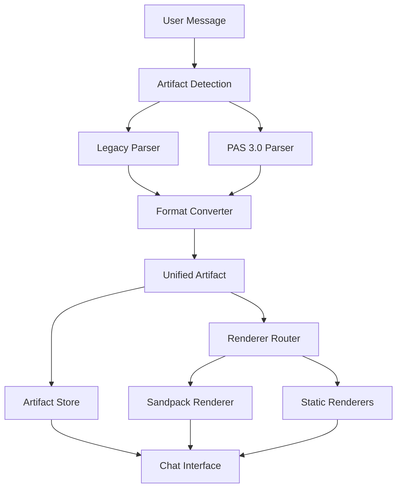

# Artifact System Technical Specification

## Overview

This document provides the technical specification for the unified artifact system in Open WebUI, supporting both legacy and PAS 3.0 artifact formats with full backward compatibility.

## Architecture Overview



## Core Interfaces

### Unified Artifact Interface

```typescript
interface UnifiedArtifact {
  // Core identification
  identifier: string;
  type: ArtifactType;
  title: string;
  description?: string;

  // Content structure
  files: ArtifactFile[];
  dependencies: ArtifactDependency[];

  // Metadata
  metadata: ArtifactMetadata;

  // Source preservation
  rawSource: string;
  sourceFormat: 'legacy' | 'pas3' | 'json';
}

interface ArtifactFile {
  path: string;
  content: string;
  language?: string;
  isEntry?: boolean;
}

interface ArtifactDependency {
  name: string;
  version: string;
  dev?: boolean;
}

interface ArtifactMetadata {
  style: 'legacy' | 'pas3';
  originalFormat: string;
  createdAt: number;
  updatedAt: number;
  chatId: string;
  messageId: string;
  // Runtime metadata
  renderCount: number;
  lastRendered?: number;
  errorCount: number;
}

type ArtifactType =
  | 'application/vnd.react+tsx'
  | 'application/vnd.react+jsx'
  | 'application/vnd.svelte'
  | 'application/vnd.svelte+ts'
  | 'text/html'
  | 'text/markdown'
  | 'image/svg+xml'
  | 'application/vnd.mermaid'
  | 'application/json'
  | 'application/javascript'
  | 'application/typescript'
  | 'text/plain';
```

### Detection Result Interface

```typescript
interface ArtifactDetectionResult {
  artifacts: UnifiedArtifact[];
  contentWithoutArtifacts: string;
  hasArtifacts: boolean;
  detectionMetadata: {
    legacyCount: number;
    pas3Count: number;
    totalProcessingTime: number;
    errors: string[];
  };
}
```

## Detection System

### Primary Detection Flow

```typescript
// src/lib/utils/artifacts/unified-detector.ts
export class UnifiedArtifactDetector {
  async detectArtifacts(content: string): Promise<ArtifactDetectionResult> {
    const startTime = performance.now();
    const result: ArtifactDetectionResult = {
      artifacts: [],
      contentWithoutArtifacts: content,
      hasArtifacts: false,
      detectionMetadata: {
        legacyCount: 0,
        pas3Count: 0,
        totalProcessingTime: 0,
        errors: []
      }
    };

    try {
      // Run both detection methods in parallel
      const [legacyResults, pas3Results] = await Promise.all([
        this.detectLegacyArtifacts(content),
        this.detectPAS3Artifacts(content)
      ]);

      // Merge results with conflict resolution
      result.artifacts = this.mergeArtifacts(legacyResults, pas3Results);
      result.contentWithoutArtifacts = this.removeArtifactsFromContent(
        content,
        result.artifacts
      );
      result.hasArtifacts = result.artifacts.length > 0;
      result.detectionMetadata.legacyCount = legacyResults.length;
      result.detectionMetadata.pas3Count = pas3Results.length;

    } catch (error) {
      result.detectionMetadata.errors.push(error.message);
    }

    result.detectionMetadata.totalProcessingTime = performance.now() - startTime;
    return result;
  }
}
```

### Legacy Detection Methods

```typescript
interface LegacyDetectionMethods {
  // Code block detection
  detectCodeBlocks(content: string): LegacyArtifact[];

  // JSON artifact detection
  detectJSONArtifacts(content: string): LegacyArtifact[];

  // Structured artifact detection
  detectStructuredArtifacts(content: string): LegacyArtifact[];
}

// Supported legacy formats
const LEGACY_CODE_PATTERNS = {
  tsx: /```(tsx|typescript-react)\n([\s\S]*?)```/gm,
  jsx: /```(jsx|javascript-react)\n([\s\S]*?)```/gm,
  svelte: /```svelte\n([\s\S]*?)```/gm,
  html: /```html\n([\s\S]*?)```/gm,
  css: /```css\n([\s\S]*?)```/gm
};
```

### PAS 3.0 Detection

```typescript
interface PAS3DetectionConfig {
  xmlParserOptions: XMLParserOptions;
  cdataHandling: 'preserve' | 'extract';
  validationLevel: 'strict' | 'permissive';
}

class PAS3ArtifactDetector {
  private xmlParser: XMLParser;

  constructor(config: PAS3DetectionConfig) {
    this.xmlParser = new XMLParser({
      ignoreAttributes: false,
      attributeNamePrefix: "@_",
      textNodeName: "#text",
      cdataPropName: "#cdata",
      // ... other options
    });
  }

  detectArtifacts(content: string): ParsedArtifact[] {
    // Extract <artifact> blocks
    const artifactBlocks = this.extractArtifactBlocks(content);

    // Parse each block
    return artifactBlocks
      .map(block => this.parseArtifactBlock(block))
      .filter(artifact => artifact !== null);
  }
}
```

## Renderer System

### Renderer Architecture

```typescript
interface ArtifactRenderer {
  canRender(artifact: UnifiedArtifact): boolean;
  render(artifact: UnifiedArtifact, options: RenderOptions): Promise<void>;
  cleanup(): void;
}

interface RenderOptions {
  container: HTMLElement;
  viewMode: 'preview' | 'code' | 'xml';
  width?: string;
  height?: string;
  theme?: 'light' | 'dark' | 'auto';
}

// Renderer registry
class RendererRegistry {
  private renderers = new Map<string, ArtifactRenderer>();

  register(type: ArtifactType, renderer: ArtifactRenderer): void;
  getRenderer(artifact: UnifiedArtifact): ArtifactRenderer | null;
  getSupportedTypes(): ArtifactType[];
}
```

### Sandpack Integration

```typescript
interface SandpackConfig {
  template: SandpackTemplate;
  files: Record<string, { code: string }>;
  dependencies: Record<string, string>;
  options: SandpackOptions;
}

class UnifiedSandpackRenderer implements ArtifactRenderer {
  private sandpackClient: SandpackClient | null = null;

  canRender(artifact: UnifiedArtifact): boolean {
    return ['application/vnd.react+tsx', 'application/vnd.react+jsx',
            'application/vnd.svelte', 'text/html'].includes(artifact.type);
  }

  async render(artifact: UnifiedArtifact, options: RenderOptions): Promise<void> {
    const config = this.buildSandpackConfig(artifact);

    // Create sandpack instance
    this.sandpackClient = createSandpackClient(
      options.container.querySelector('iframe'),
      config,
      {
        showOpenInCodeSandbox: false,
        showNavigator: false,
        showRefreshButton: true
      }
    );

    // Set up event listeners
    this.setupEventListeners();
  }

  private buildSandpackConfig(artifact: UnifiedArtifact): SandpackConfig {
    const template = this.determineTemplate(artifact.type);
    const files = this.prepareFiles(artifact);
    const dependencies = this.prepareDependencies(artifact);

    return { template, files, dependencies, options: {} };
  }
}
```

## Format Conversion

### Legacy to Unified Conversion

```typescript
class LegacyToUnifiedConverter {
  convert(legacyArtifact: DetectedArtifact): UnifiedArtifact {
    const base: UnifiedArtifact = {
      identifier: this.generateIdentifier(legacyArtifact),
      type: this.mapLegacyType(legacyArtifact.type),
      title: legacyArtifact.title || 'Untitled Artifact',
      files: [],
      dependencies: [],
      metadata: {
        style: 'legacy',
        originalFormat: this.detectOriginalFormat(legacyArtifact),
        createdAt: Date.now(),
        updatedAt: Date.now(),
        chatId: '', // Set by integration layer
        messageId: '', // Set by integration layer
        renderCount: 0,
        errorCount: 0
      },
      rawSource: this.reconstructSource(legacyArtifact),
      sourceFormat: 'legacy'
    };

    // Convert based on legacy type
    switch (legacyArtifact.type) {
      case 'react':
        return this.convertReactArtifact(legacyArtifact, base);
      case 'svelte':
        return this.convertSvelteArtifact(legacyArtifact, base);
      case 'html':
      case 'svg':
      case 'mermaid':
        return this.convertStaticArtifact(legacyArtifact, base);
      default:
        throw new Error(`Unsupported legacy artifact type: ${legacyArtifact.type}`);
    }
  }

  private convertReactArtifact(legacy: ReactLegacyArtifact, base: UnifiedArtifact): UnifiedArtifact {
    const files: ArtifactFile[] = [
      {
        path: '/App.tsx',
        content: legacy.entryCode,
        language: 'typescript',
        isEntry: true
      }
    ];

    // Add extra files if present
    if (legacy.extraFiles) {
      Object.entries(legacy.extraFiles).forEach(([path, content]) => {
        files.push({
          path: path.startsWith('/') ? path : `/${path}`,
          content,
          language: this.detectLanguage(path)
        });
      });
    }

    // Add CSS if present
    if (legacy.css) {
      files.push({
        path: '/styles.css',
        content: legacy.css,
        language: 'css'
      });
    }

    // Convert dependencies
    const dependencies: ArtifactDependency[] = Object.entries(legacy.dependencies || {})
      .map(([name, version]) => ({ name, version }));

    return {
      ...base,
      files,
      dependencies,
      type: this.hasTypeScript(legacy.entryCode) ?
            'application/vnd.react+tsx' : 'application/vnd.react+jsx'
    };
  }
}
```

### PAS 3.0 to Unified Conversion

```typescript
class PAS3ToUnifiedConverter {
  convert(pas3Artifact: ParsedArtifact): UnifiedArtifact {
    return {
      identifier: pas3Artifact.identifier,
      type: pas3Artifact.type as ArtifactType,
      title: pas3Artifact.title,
      description: pas3Artifact.description,
      files: pas3Artifact.files,
      dependencies: pas3Artifact.dependencies,
      metadata: {
        style: 'pas3',
        originalFormat: 'xml',
        createdAt: Date.now(),
        updatedAt: Date.now(),
        chatId: '', // Set by integration layer
        messageId: '', // Set by integration layer
        renderCount: 0,
        errorCount: 0
      },
      rawSource: pas3Artifact.rawXml,
      sourceFormat: 'pas3'
    };
  }
}
```

## State Management

### Artifact Store Enhancement

```typescript
interface UnifiedArtifactStore {
  // Core state
  artifacts: Map<string, ArtifactContainer>;
  uiState: ArtifactUIState;

  // Actions
  addArtifact(artifact: UnifiedArtifact, chatId: string, messageId: string): void;
  updateArtifact(identifier: string, updates: Partial<UnifiedArtifact>): void;
  removeArtifact(identifier: string): void;

  // Queries
  getArtifact(identifier: string): ArtifactContainer | null;
  getChatArtifacts(chatId: string): ArtifactContainer[];
  getMessageArtifacts(messageId: string): ArtifactContainer[];

  // Metadata operations
  incrementRenderCount(identifier: string): void;
  recordError(identifier: string, error: string): void;
  updateLastRendered(identifier: string): void;
}

interface ArtifactContainer {
  artifact: UnifiedArtifact;
  chatId: string;
  messageId: string;
  createdAt: number;
  updatedAt: number;

  // Runtime state
  isRendering: boolean;
  lastError?: string;
  renderHistory: RenderEvent[];
}

interface RenderEvent {
  timestamp: number;
  renderer: string;
  success: boolean;
  duration: number;
  error?: string;
}
```

## Error Handling & Reliability

### Error Categories

```typescript
enum ArtifactErrorType {
  DETECTION_FAILED = 'detection_failed',
  PARSING_FAILED = 'parsing_failed',
  CONVERSION_FAILED = 'conversion_failed',
  RENDERING_FAILED = 'rendering_failed',
  DEPENDENCY_FAILED = 'dependency_failed',
  SECURITY_VIOLATION = 'security_violation'
}

interface ArtifactError {
  type: ArtifactErrorType;
  message: string;
  artifactId?: string;
  context: Record<string, any>;
  timestamp: number;
  stack?: string;
}

class ArtifactErrorHandler {
  private errorLog: ArtifactError[] = [];

  handleError(error: ArtifactError): void {
    this.errorLog.push(error);

    // Report to analytics
    this.reportError(error);

    // Trigger fallback behavior
    this.triggerFallback(error);
  }

  private triggerFallback(error: ArtifactError): void {
    switch (error.type) {
      case ArtifactErrorType.RENDERING_FAILED:
        // Show code view instead of preview
        this.showCodeFallback(error.artifactId);
        break;
      case ArtifactErrorType.DEPENDENCY_FAILED:
        // Try rendering without problematic dependencies
        this.retryWithoutDependencies(error.artifactId);
        break;
      // ... other fallback strategies
    }
  }
}
```

### Retry Logic

```typescript
interface RetryConfig {
  maxAttempts: number;
  backoffStrategy: 'linear' | 'exponential';
  baseDelay: number;
  maxDelay: number;
}

class ArtifactRetryManager {
  private attempts = new Map<string, number>();

  async withRetry<T>(
    operation: () => Promise<T>,
    config: RetryConfig,
    context: string
  ): Promise<T> {
    let lastError: Error;

    for (let attempt = 1; attempt <= config.maxAttempts; attempt++) {
      try {
        return await operation();
      } catch (error) {
        lastError = error;

        if (attempt === config.maxAttempts) {
          break;
        }

        const delay = this.calculateDelay(attempt, config);
        await this.sleep(delay);
      }
    }

    throw new Error(`Operation failed after ${config.maxAttempts} attempts: ${lastError.message}`);
  }
}
```

## Performance Considerations

### Optimization Strategies

```typescript
interface PerformanceConfig {
  // Detection optimization
  maxDetectionTime: number; // 100ms
  enableCaching: boolean;
  cacheSize: number;

  // Rendering optimization
  lazyLoadThreshold: number; // bytes
  preloadNextArtifact: boolean;
  maxConcurrentRenders: number;

  // Memory management
  maxArtifactsInMemory: number;
  artifactGCInterval: number; // ms
}

class ArtifactPerformanceManager {
  private detectionCache = new Map<string, ArtifactDetectionResult>();
  private renderQueue: RenderTask[] = [];

  async optimizedDetection(content: string): Promise<ArtifactDetectionResult> {
    const cacheKey = this.hashContent(content);

    if (this.detectionCache.has(cacheKey)) {
      return this.detectionCache.get(cacheKey);
    }

    const startTime = performance.now();
    const result = await this.detector.detectArtifacts(content);
    const duration = performance.now() - startTime;

    // Cache if detection was fast enough
    if (duration < this.config.maxDetectionTime) {
      this.detectionCache.set(cacheKey, result);
    }

    return result;
  }

  async queueRender(artifact: UnifiedArtifact, options: RenderOptions): Promise<void> {
    if (this.shouldLazyLoad(artifact)) {
      return this.scheduleRender(artifact, options);
    }

    return this.immediateRender(artifact, options);
  }
}
```

## Security Considerations

### Content Sanitization

```typescript
interface SecurityConfig {
  allowedDomains: string[];
  blockedPackages: string[];
  maxFileSize: number;
  allowedFileTypes: string[];
  enableCSP: boolean;
  sandboxLevel: 'strict' | 'moderate' | 'permissive';
}

class ArtifactSecurityManager {
  private csp: ContentSecurityPolicy;

  validateArtifact(artifact: UnifiedArtifact): SecurityValidationResult {
    const issues: SecurityIssue[] = [];

    // Check file contents
    for (const file of artifact.files) {
      issues.push(...this.scanFileContent(file));
    }

    // Check dependencies
    issues.push(...this.validateDependencies(artifact.dependencies));

    // Check overall size
    if (this.calculateArtifactSize(artifact) > this.config.maxFileSize) {
      issues.push({
        type: 'size_violation',
        severity: 'high',
        message: 'Artifact exceeds maximum size limit'
      });
    }

    return {
      isValid: issues.filter(i => i.severity === 'high').length === 0,
      issues,
      sanitizedArtifact: this.sanitizeArtifact(artifact, issues)
    };
  }

  private sanitizeArtifact(artifact: UnifiedArtifact, issues: SecurityIssue[]): UnifiedArtifact {
    // Apply sanitization based on identified issues
    const sanitized = { ...artifact };

    // Remove dangerous content
    sanitized.files = sanitized.files.map(file => ({
      ...file,
      content: this.sanitizeCode(file.content, file.language)
    }));

    // Filter dependencies
    sanitized.dependencies = sanitized.dependencies.filter(dep =>
      !this.config.blockedPackages.includes(dep.name)
    );

    return sanitized;
  }
}
```

## Testing Strategy

### Test Coverage Requirements

```typescript
interface TestSuite {
  unit: {
    detectionTests: TestCase[];
    conversionTests: TestCase[];
    renderingTests: TestCase[];
    securityTests: TestCase[];
  };

  integration: {
    endToEndTests: TestCase[];
    performanceTests: TestCase[];
    compatibilityTests: TestCase[];
  };

  visual: {
    snapshotTests: TestCase[];
    accessibilityTests: TestCase[];
  };
}

// Example test cases
const DETECTION_TEST_CASES: TestCase[] = [
  {
    name: 'Legacy React code block detection',
    input: '```jsx\nfunction App() { return <div>Hello</div>; }\n```',
    expected: { artifactCount: 1, type: 'application/vnd.react+jsx' }
  },
  {
    name: 'PAS 3.0 XML artifact detection',
    input: '<artifact identifier="test" type="application/vnd.react+tsx">...</artifact>',
    expected: { artifactCount: 1, type: 'application/vnd.react+tsx' }
  },
  {
    name: 'Mixed format detection',
    input: '```jsx\n...\n```\n<artifact>...</artifact>',
    expected: { artifactCount: 2, formats: ['legacy', 'pas3'] }
  }
];
```

## Migration Guide

### Backward Compatibility

All existing artifacts must continue to work without modification. The migration strategy ensures:

1. **Automatic Detection**: Legacy artifacts are automatically detected and converted
2. **Format Preservation**: Original source is preserved for debugging
3. **API Compatibility**: Existing artifact store APIs remain unchanged
4. **Gradual Migration**: New features are additive, not replacing

### Migration Timeline

- **Phase 1**: Implement unified detection (backward compatible)
- **Phase 2**: Add PAS 3.0 support (additive)
- **Phase 3**: Optimize and consolidate renderers
- **Phase 4**: Enhanced features and performance improvements

This specification provides the foundation for a robust, extensible artifact system that supports both legacy and modern formats while maintaining excellent performance and security.